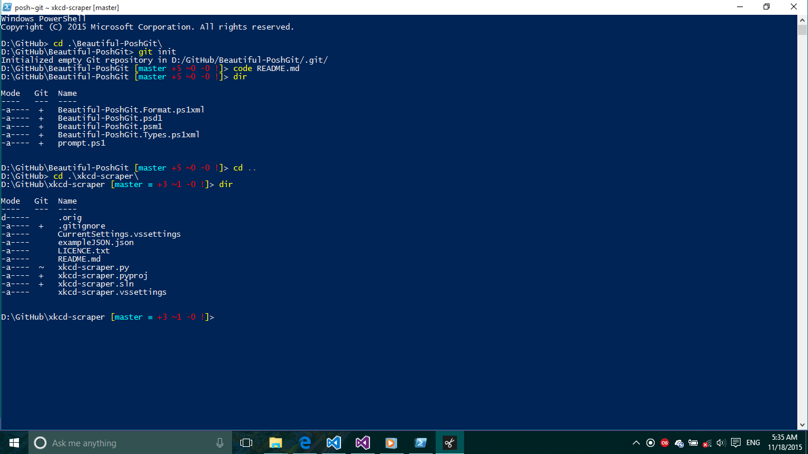

# Beautiful-PoshGit

My cosmetic improvements to Posh-Git.

</img>

Most of the important work was done by Scott Hanselman (@shanselman). I hope he doesn't get angry... :P

# Installation

Sorry Unix people, not for you. :(
You need to have [Posh-Git](https://github.com/dahlbyk/posh-git) installed. Thanks Keith Dahlby (@dahlbyk)
See <a href="#installing">here</a> for instructions if you don't already have that.

If you have installed PoshGit:
```
cd $env:USERPROFILE/Documents/WindowsPowerShell/Modules
git clone https://github.com/hashhar/beautiful-poshgit.git Beautiful-PoshGit
```
You will have to reopen PowerShell and run `Import-Module Beautiful-PoshGit` everytime you open PowerShell. If you want it to be loaded automatically run,
```
Copy-Item $env:USERPROFILE\Documents\WindowsPowerShell\Modules\Beautiful-PoshGit\Microsoft.PowerShell_profile.ps1 -Destination $env:USERPROFILE\Documents\WindowsPowerShell\Microsoft.PowerShell_profile.ps1
```

## <h2 id="installing" name="installing">Installing Posh-Git</h2>

#### If you have [PsGet](http://psget.net/) (if not, you should check it out) installed just run:
```
Install-Module posh-git
```

#### Installing (manual)

0. Verify you have PowerShell 2.0 or better with `$PSVersionTable.PSVersion`. PowerShell 3.0 is preferred as 2.0 support is deprecated.

1. Verify execution of scripts is allowed with `Get-ExecutionPolicy` (should be `RemoteSigned` or `Unrestricted`). If scripts are not enabled, run PowerShell as Administrator and call `Set-ExecutionPolicy RemoteSigned -Scope CurrentUser -Confirm`.

2. Verify that `git` can be run from PowerShell.
   If the command is not found, you will need to add a git alias or add `%ProgramFiles(x86)%\Git\cmd`
   (or `%ProgramFiles%\Git\cmd` if you're still on 32-bit) to your `PATH` environment variable.

3. Clone the posh-git repository to your local machine.

4. From the posh-git repository directory, run `.\install.ps1`.

5. Enjoy!
